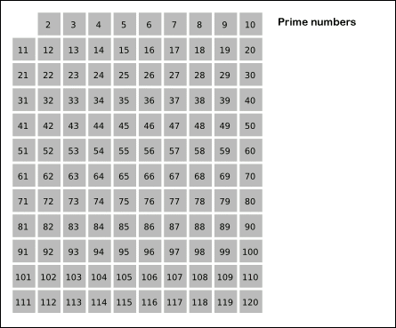

# 소수 구하기 (에라토스테네스의 체) 

자바스크립트로 소수 구하기 문제를 풀던 도중, 처음 제출했던 코드가 속도가 느려서 통과하지 못했다. 어떻게 풀어나가야 할지 찾아보다가 **에라토스테네스의 체** 라는 것을 알게 되었다. 구현 코드를 보고 싶었는데, 한글 포스팅 중 자바스크립트로 작성된 것이 없어서 포스팅을 하기로 마음먹었다.

---

## 소수

소수 문제를 풀기 위한 몇 가지 개념을 살펴보자

- 소수는 1과 자기 자신으로만 나누어지는 수 이다.
- 1은 소수가 아니다.
- 모든 자연수는 소수들의 곱으로 표현된다.


위의 개념을 바탕으로 처음에는 아래와 같이 풀었다.

```javascript
function solution(n) {
  let isPrime = true;
    let count = 0;
    
    for (let i = 2; i <= n; i++) {
        for (let j = 2; j * j <= i; j++) {
            if (i % j === 0) {
                isPrime = false;
                break;
            }
        }
        
        if (isPrime === true) {
            count += 1;
        }
        
        isPrime = true;
    } 
    
    return count;
}
```

원하는 결과는 얻을 수 있었지만, 속도가 느려서 테스트에 통과하지 못했다. (문제를 풀고나서 다른 사람의 코드를 보니, 생각해서 풀 수 있는 다양한 경우의 수가 있었다. 테스트에 통과하지 못해도 좀 더 고민해보면 좋을 것 같다)


다음은 이 문제를 해결하기 위해 사용한 '**에라토스테네스의 체**' 이다.

---

## 에라토스테네스의 체는 무엇인가?

에라토스테네스가 발견한 소수를 찾는 방법이다. 위에서 **모든 자연수는 소수들의 곱으로 표현**된다고 했다. 그래서 에라토스테네스는 주어진 숫자 값의 범위 안에서, 자기 자신을 제외한 배수 값을 지워 나갔다. 결국 소수만 남게 된다.

어떤 값을 입력받고 소수를 출력하는 것이 아닌, **입력 받은 숫자 까지의 정수 중 소수의 개수**를 구해야 할 때 유용하다.

이해를 위해 위키백과에서 제공하는 예제 이미지를 보자 🤩



구현 코드는 다음과 같다.

```javascript
function solution(n) {
    const arr = [], output = [];
    
    // 인덱스 번호가 주어진 숫자 n과 대응하도록 
		// 빈 배열을 만들고 원소는 true 값으로 채워준다.
  	// 여기서 true 는 소수라는 의미이다.
		// 배열은 0부터 시작하므로, 주어진 숫자 n에 1을 더해준다.
    for (let i = 0; i < n + 1; i += 1) {
        arr.push(true);
    }
    
    // 주어진 수의 제곱근까지만 계산해서 불필요한 반복을 최소화한다.
    // arr[i] 가 소수일 경우, 반복문을 진행한다.
    // 맨 처음 시작하는 2는 소수이므로,
    // 2를 제외한 2의 제곱부터, 제곱 값만 체크하여 지워나간다.
  	// 제곱근까지 반복한다.
    for (let i = 2; i * i <= n; i += 1) {
        if (arr[i]) {
            for (let j = i * i; j <= n; j += i) {
                arr[j] = false;
            }
        }
    }
    
  	// 0과 1은 소수가 아니므로 false 값으로 바꿔준다.
    arr.splice(0, 2, false, false);
    
  	// 배열에서 true인 값만 걸러내고, true인 값의 개수를 출력한다.
    const result = arr.filter((value) => {
        return value !== false;
    })
    
    return result.length;
}
```


---
출처: [프로그래머스](https://programmers.co.kr/learn/courses/30/lessons/12921) / [위키백과](https://ko.wikipedia.org/wiki/에라토스테네스의_체)


