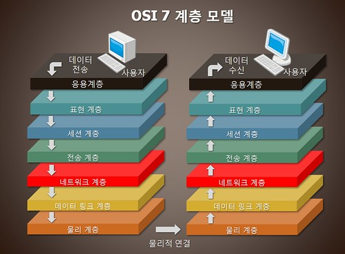

> 이 글은 Codeflow라는 사이트의 강의를 듣고 개인적으로 정리한 내용을 담고 있습니다. 
> 아직 초보적인 단계라 부족하거나 잘못된 부분이 있을 수 있습니다.  
> 혹시 잘못되거나 첨언할 내용이 있다면  댓글 남겨주시면 감사하겠습니다.
---

### <u>Network</u>

네트워크라는 개념은 왜 생겨났을까?

우선 네트워크에서 가장 중요한 것은 '리소스의 공유' 이다. 한 대의 컴퓨터가 가진 리소스를 다른 컴퓨터와 공유하기 위해서, 네트워크라는 개념이 발전되었다고 볼 수 있다.

옛날에는 프린터 같은 장비들이 매우 고가라 컴퓨터마다 연결해서 쓰기가 어려웠다. 그래서 컴퓨터 몇 대를 연결해서 사용해야 했었고, 이런 개념들이 점차 발전하여 지금의 컴퓨터 네트워크의 개념이 형성되었다.

이 네트워크는 범위 혹은 규모로 분류할 수 있다. 여기서 `LAN` 과 `WAN` 이라는 개념이 나타나게 된다.

---

**LAN** (Local Area Network): 사용자가 포함된 지역 네트워크 (ex. 대학 내)

**WAN** (Wide Area Network): 통신사업자에 의해 연결되는 광역 네트워크 (ex. 대학과 대학, 도시와 도시, 국가와 국가 등 넓은 범위)

먼저 LAN은 집이나 회사, 학교의 컴퓨터, 전화기 같은 장비를 서로 연결한 것이다. 대학 내의 네트워크 망도 LAN 이라고 할 수 있다. 이 때 본래의 목적인 리소스의 공유 측면에서 보면, 다른 대학의 LAN과 연결되면 더욱 좋을 것이다.

그래서 더 넓은 범위의 규모로 연결된 개념이 WAN 이다. WAN은 통신사업자(국내의 경우 sk, kt, lg 등)에 의해 연결되는 네트워크이다. 좁은 범위는 대학과 대학이지만, 넓게는 도시와 도시, 국가와 국가 간의 연결도 포함한다.

---

### <u>Protocol</u>

하지만 이 리소스를 공유하기 위해서는 서로 이해할 수 있는 약속이 필요했다. 그래서 나온 개념이 프로토콜이다. 프로토콜은 네트워크 안에서 데이터 전송 시 필요한 규칙이나 약속을 정의한 것이다. 현재 인터넷에서 사용하는 핵심 프로토콜은 `TCP / IP` 이다.

---

<u>(!) 잠깐 단어 짚고 가기</u>

**인트라넷 (Intranet)**: 폐쇄적으로 운영되는 네트워크망 (ex. 군대, 회사 등 조직에서 내부적으로 이용하기 위해 사용)

**인터넷 (Internet)**: Public 하게 공개되는 네트워크망

**호스트 (Host)**: 단일한 Node, Machine, 즉 하나의 네트워크 주체로서 행동하는 Machine

---

### <u>통신의 원리</u>

카카오톡으로 친구에게 메세지를 보낼 때 통신은 네트워크 주체인 호스트 간에 이루어질까?

**주체인 호스트 아래 실제 행동을 옮기는 `프로세스` 간에 이루어 진다.**

<u>구분하기 위한 것들</u>

1. `호스트` 네트워크 안에서 호스트를 구분하기 위한 표식으로 <IP 주소> 사용

2. `프로세스` 호스트 상에서 프로세스를 구분하기 위한 표식으로 <포트 번호> 사용
3. `NIC`(Network Interface Controller) 네트워크(네트워크 장치, 이더넷, 와이파이, 블루투스 등) 안에서 장치를 구분하기 위한 표식으로 <MAC 주소> 사용

**(Q1) 두 개의 주소가 필요할까? (MAC, IP)**

- IP는 라우팅에 적합하게 설계된 주소 체계
  - Routing: 네트워크 안에서 통신 데이터를 어디로 보낼 것인지 선택하는 과정
  - (의문사항) 왜 IP가 라우팅에 적합한가?

**(A1)** **OSI 7 Layer**

OSI 7 계층은 통신이 일어나는 과정을 7단계로 나눈 것이다.

우리는 지금 친구에게 메세지를 보내는 상황이었다.

1. **7계층, 응용 계층 (Application Layer)**

   HTTP 같은 프로토콜을 바탕으로 응용 프로그램에서 메세지를 보낸다.

2. **6계층, 표현 계층 (Presentation Layer)**

   메세지를 인코딩하거나 암호화

3. **5계층, 세션 계층 (Session Layer)**

   메세지를 통신하기 위한 논리적인 연결 단계. TCP/IP 세션을 만들고 없애는 책임을 짐

4. **4계층, 전송 계층 (Transport Layer)**

   보내거나/받는 프로세스를 식별하기 위해 부가 데이터(Port)를 추가한다.

5. **3계층, 네트워크 계층 (Network Layer)**

   데이터를 목적지까지 가장 안전하고 빠르게 전달하기 위한 라우팅 기능. IP 주소를 정하고 경로에 따라 패킷을 전달해준다.

   **HTTP packet**

   > HTTP 프로토콜을 이용한 경우 보내는 데이터를 HTTP packet 이라고 한다. HTTP packet의 구조는 크게 Header 와 Body 로 나뉘어진다. Header에는 메세지를 보내기 위해 7가지 HTTP Method 중 무엇을 사용했는지, 클라이언트 정보, 브라우저 정보, 접속할 URL 등과 같은 클라이언트 정보를 담는다. Body는 보통 비어 있지만 특정 데이터를 담아서 서버에 요청을 보낼 수 있다. 상기의 개념 아래, 보통 웹에서는 HTTP의 Method인 GET과 POST를 통해 요청한다.

6. **2계층, 데이터링크 계층 (Datalink Layer)**

   안전한 정보의 전달을 수행할 수 있도록 도와준다. 이 계층에서 MAC 주소를 가지고 통신한다. IP 주소는 하나의 호스트를 나타내는 주소지만, MAC 주소는 호스트에 연결된 물리적 통신 장치 하나를 나타내는 주소이다. 따라서 MAC 주소는 IP 주소와 달리 유일한 불변값이다.

7. **1계층, 물리 계층 (Physical Layer)**

   단순히 통신 케이블로 데이터를 주고받는 역할을 한다.

---

(추후 업데이트 할 내용)

- TCP, UDP
- 프로토콜에 대한 간략한 개념들
- 서비스의 네트워킹 형태