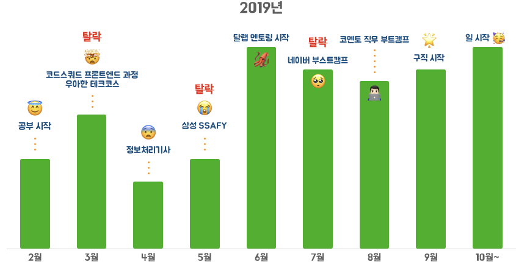
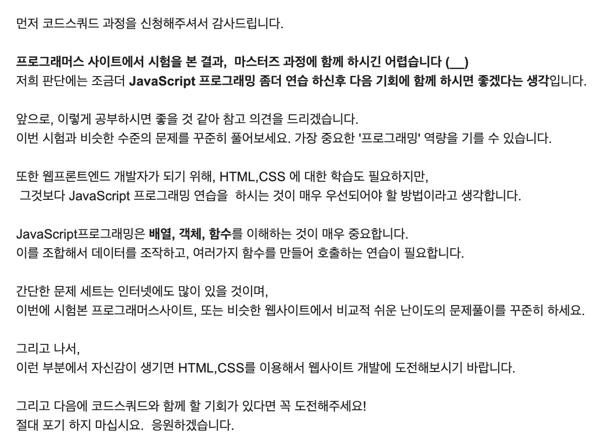
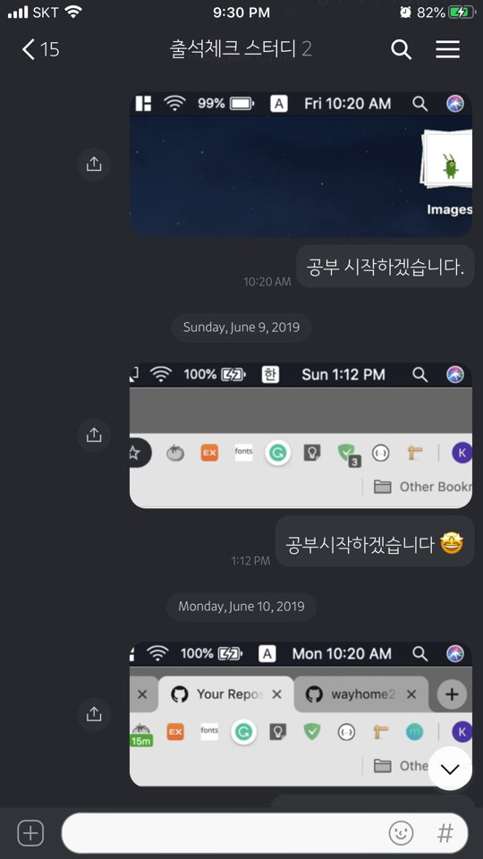
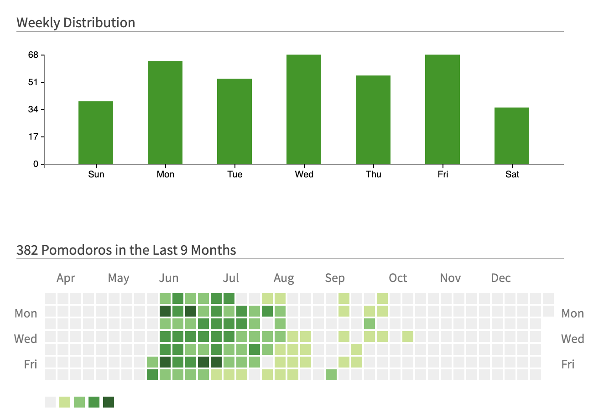
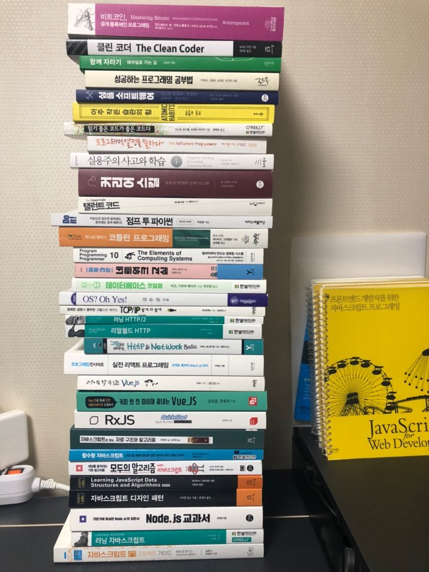

> 개발자가 되기까지의 2019년을 되돌아보는 회고록입니다.  
> 다른 분들의 회고 글을 볼 때마다 동기부여를 많이 받았습니다.  
> 저도 언젠간 써보고 싶다고 생각했기에 이렇게 작성해봅니다 🙂  
> 많이 부족한 회고지만, 그래도 재밌게 볼 수 있는 회고가 되었으면 좋겠습니다.

시작하기에 앞서 간략하게 요약된 슬픈 그래프가 있다.

그동안을 돌아봤을 때 정말 최선을 다했다고는 말할 수 없을 것 같다. 

열심히 하지 않는다고 자신을 채찍질하는 일도 잦았다. 이렇게 해도 되는 건가 하는 막연함도 있었고, 

이 노력을 원래 분야에 쏟아부었다면 훨씬 더 좋은 성과를 얻지 않았을까 하는 후회도 있었다.

그런데도 개발 공부를 포기하지는 않았고, 결국 두 번째 작은 걸음을 내딛게 됐다.

---

## 첫 걸음을 내딛게 된 계기

---

### 객관적인 직업이라는 생각이 들었다

개인적으로 기획이나 마케팅 직무에 회의감이 들었다. 논리적 설득보다는 결정권을 가진 상대방의 입맛에 달린 일이라는 생각이 자꾸 들었다. 열심히 해도 남는 것은 그 순간에만 필요 있는 글자와 이미지 덩어리라는 부정적 생각에 사로잡혀 있었다.  (~~지금은 편협한 생각이었다고 느낀다~~)

**노력을 증명할 수 있는 직업을 찾고 싶었다.**

그래서 무작정 현 상황에서 할 수 있는 여러 가지를 시도했다. 당시에 `회사(주 3일) + 학교(주 2일) + 기업 공채`를 병행했는데, 무언가 열심히 하는 것 같지만 혼란이 많은 상태였다.

그러던 중 학교 수업에서 사회 문제를 해결하는 프로젝트를 진행하게 됐다. 우리 조가 맡은 주제는 퀴즈를 제공할 무언가가 필요했다. 이때다 싶어 **화석 학번**인 나는 웹사이트를 만들 것을 제안(~~강요아님~~)했고, 워드프레스 위에다 HTML, CSS, PHP가 뭔지도 모른 채 복붙신공으로 어떻게든 프로토타입을 만들었다. 이때 당연하게도 문제가 막 터져 나왔는데, 문제를 해결하는 과정속에서 오랜만에 꽤 몰입했다는 느낌을 받았다. 물론 프로젝트는 망해버렸고 팀원들에게는 정말 미안하다 😅😅😅

아무튼 이때는 개발이란 일 자체가 굉장히 객관적으로 자신을 증명할 수 있는 일이라 생각했고, 잠깐의 맛보기 경험도 인상 깊었다.

금세 `회사 + 학교 + 공채`라는 광란의 시간이 끝나고 고요함이 찾아왔다. 회사는 **퇴사**, 학교는 **졸업**, 공채는 **광탈**이었다. 고요하니까 생각할 시간이 많아졌고, 진지하게 직업에 대해 고민하는 시간을 두 달 정도 가졌다.

두 달 동안 나름 혼자 고민도 하고, 같이 일했던 개발자분을 찾아가 조언도 구하고, 맛보기 경험도 다시 한번 떠올리다 보니까, 한 가지 결론에 다다랐다. 

`그래 내가 무슨 고민이냐 일단 한번 해보자`

 

## 포기가 간절했던 시작

---

### 코드스쿼드 마스터즈 코스 1레벨 강의

아... 이거 처음 들었을 때 정말 포기가 간절했다. 무슨 구구단 구현하는 데 일주일이 걸렸다. 강의에서는 계속 스스로 고민해보라고 해서, 정말 스스로 해결할 때까지 고민하다가 던지고 고민하다가 던지고를 반복했다. 어느 날은 정말 너무 답답해서, 개발 공부하는 친구한테 차마 어떻게 해야 하는 건지 물어보지는 못하고 **'이거 원래 이렇게 어려운 게 맞냐...?'** 라는 이상한 질문만 거듭했다.

혹시 개발 공부를 하면서 스스로가 재능이 너무 없는 것 아닌가 느끼는 분들이 있다면, 그렇게 생각할 필요가 없다고 말하고 싶다. **나는 훨씬 더 멍청했고, 지금도 멍청하지만 어찌어찌 일은 하고 있다.**

하여튼 같이 일했던 개발자분이 코드스쿼드를 추천해줘서 듣게 된 강의였다. 지금 생각에는 이 강의가 개발에 대한 좋은 사고 하나를 가지게 해주었고, 초기에 큰 동기부여의 계기가 됐다.

결론적으로는 코드스쿼드의 코딩테스트를 보기 전에 완강하지 못했고, 코딩테스트에서는 한 문제도 풀지 못했다. 이때 ~~롬곡옾눞~~을 흘렸는데, 탈락을 안내해주는 마스터님의 메일이 인상 깊었다.

특히 마지막 말이 너무 인상 깊어서 언젠가 다시 도전해서 합격해야겠다고 다짐했다. 이 메일은 초기에 어려움을 느낄 때마다 몇 번이고 반복해서 읽었다.

 

### 연이은 탈락 공세와 삽질

1. **우아한 테크코스**

   코드스쿼드 코딩테스트에 이어서 우아한 테크코스 시험을 같은 달에 봤다. 이때는 운 좋게 7문제 중 3문제 정도 풀 수 있었다. 끝나고 후기를 보니까 7문제 다 풀었다는 사람들이 많아서 약간 슬펐지만, 이번엔 한 문제라도 풀었다는 점이 내게는 굉장히 뜻깊었다. (~~맞았는지는 모른다~~) 수원역 안에 있는 매우 시끄러운 카페에서 시험에 응시했는데, 지금 생각해보면 미틴넘이 아니었나 싶다.

2. **정보처리기사**

   필기에 합격하기는 했는데 이거 공부한다고 코딩을 안 했다. ~~**흑흑 나는 개발자로서 탈락이야.**~~ 그리고 이후에 '지금 중요한 건 이게 아니야!' 라고 자신을 합리화하며 실기를 안 본 것이 함정이다. 웹서핑을 자주 하다 보니까 좋은 개발자처럼 보이는 사람은 항상 컴퓨터 공학을 강조했다. 정보처리기사는 컴퓨터 공학을 공부하기 위한 꽤 괜찮은 동기부여 수단이라고 생각했다. 곧바로 시험에 응시했다. 개인적으로 컴퓨터 공학에 대해 가지는 비전공자만의 낯선 느낌을 조금이나마 없애줬다고 생각한다.

3. **삼성 SSAFY**

   프로그래밍 언어를 사용하지 않는 알고리즘 시험 느낌이었다. '한 달에 100만 원 개꿀~' 이라고 생각하며 적성 책도 구매하고 시험에 응시했지만, 결국 탈락하고 말았다.

4. **깃헙 블로그의 로망**

   처음에 언급한 같이 일했던 개발자분이, 초보몽키님의 개발 블로그를 소개해주었다. TIL이라는 개념도 신선했고, 나와 같은 비전공자에 매일매일 깃헙(~~**중요**~~) 블로그 글을 작성하는 그 성실함이 ~~개쩐다~~ 멋있다고 생각했다. 계속해서 깃헙 블로그를 만들려고 시도했다. 처음에는 티스토리로 만들었다가, 체대 출신 개발자님의 블로그를 보고 hugo부터 시작해서 jekyll, gatsby까지 삽질에 삽질을 거듭하다 결국 gatsby에 정착했다. 마음에 드는 테마의 여부, 수정하다가 계속 오류가 생기는 문제로 정착하지 못했었는데 결론적으로는 이 과정에서 cli 환경에 대한 거부감이 많이 없어졌다.

이때까지는 솔직히 많은 시간을 공부에 할애하지는 않았던 것 같다. 알바 문제(부모님 돈 빌려 쓰기가 싫었다)도 있었고 집에서는 공부에 집중을 못 했다. 정처 없이 공부할 곳을 떠돌아다녔었는데, 이때 도움을 받았던 장소를 간략히 공유해보자면,

- [무중력지대](http://www.youthzone.kr/)
- [서울창업허브](http://seoulstartuphub.com/)

특히 서울창업허브는 주말이나 공휴일에도 오픈해서 집에서는 공부를 절대 안 하는 나에게 굉장히 단비 같았다. 이외에도 요즘에는 무료로 공부할 공간을 제공해주는 곳이 많으니, 나와 같은 사람이 있다면 주변을 잘 찾아보면 좋겠다.

 

## Burn

---

6월에 접어들어서야 꽤나 적극적으로 공부하기 시작했다. 이렇게 바뀐 계기가 몇 가지 있는데,

- 아르바이트 시간을 오전 7시에서 오전 10시까지로 바꿨다.
- 깃헙 블로그를 드디어 오픈했다.
- 스스로가 한심했다.
- 달랩 멘토링을 시작했다.

 

1. **아르바이트 시간을 평일 오전 7시~10시까지로 바꿨다.**

   아르바이트 시간이 불규칙한 것이 꽤 불만이었다. 이전까지는 애매한 점심시간이거나 주말 저녁에 하곤 했었다. 우연히 자리가 나서 위에서 언급한 무중력지대 근처에서 일하고 이후에는 무중력지대에서 공부했다.

   

   출석체크 스터디란 것을 만들어서 했는데, 아르바이트를 바꾼 이후부터 꾸준히 인증한 것 같다. 사진만 보면 혼자밖에 안 한 것 같지만, 몇 분은 꾸준히 참여해주었다. (글을 작성하는 시점에서 스크린샷을 캡쳐해서 사진이 어색하다 😅) 이때 알게 된 한 분이랑 지금까지 연락을 이어오고 있다. 이후에 만나서 면접 대비 스터디도 같이하고 재미있는 경험으로 발전했다.

   이렇게 규칙적으로 시간을 만드니깐, 효율성을 높이기 위해 공부 시간을 측정하고 싶다는 생각이 들었다. 뽀모도로 기법에 대해서 알게 됐고, 뽀모도로 히스토리를 깃헙처럼 보여주는 크롬 익스텐션 앱이 있길래 사용해보았다.

   

   아쉽기는 하지만 그래도 6월, 7월은 나름 꾸준히 측정하려고 노력했다.

2. **깃헙 블로그를 드디어 오픈했다.**

   이때부터 TIL을 매일 작성했다. 중간중간에 술 마시고 빠트린 적도 한두 번 있는 것 같다. 그래도 술 마시고 새벽 2시에도 쓸 정도로 집착하면서 작성했다. 깃헙 커밋의 대부분이 블로그 TIL이고, 이 부분에 있어서 스스로도 많이 고민했지만, 만약 TIL을 작성하지 않았다면 이렇게까지 지속해서 공부할 수 없었을 것 같다.

3. **스스로가 한심했다.**

   공부 열심히 해야지 생각만 하고, 미친듯이 한 적은 한 번도 없었던 것 같다는 생각이 들었다. 반성에 반성이다.

4. **달랩 멘토링을 시작했다.**

   독학의 불안감에 학원을 정처 없이 찾아다니다가 달랩 멘토링을 선택하게 됐다. 이 선택에 결정적인 영향을 끼친 것은 `좋은 학원은 가르치는 것이 아니라 가리키는 것이 중심`이 된다는 생각이었다. 공부는 결국 혼자 해야 한다. 이런 점에서 봤을 때 달렙 멘토링은 저렴한 가격에 좋은 방향으로 빛을 밝혀주는 등대라고 생각했다. 덧붙여서 평소 환경의 중요성에 크게 공감한다. 열심히 하려는 사람들이 모이다 보니까 자연스럽게 나도 열심히 하게 되었던 것 같다. 비싸고 들어가기 어려운 학원이 좋은 이유 중 하나도 여기 있다고 생각한다.

   개인적으로 국비지원학원은 앞서 말한 방향이 잘못되었다고 생각해서, 처음부터 전혀 고려하지 않았다. 물론 공부는 혼자 해야 하기 때문에 개인의 의지만 있다면 간다고 해서 큰 영향을 주지는 않는다고 생각한다.

   아무튼, 좋은 코드에 대해서 고민하는 계기가 되었다. TDD도 이때 처음 알게되었다. 그리고 열정 있는 사람들을 만날 수 있었다. 멘토링 활동에 매우 적극적으로 참여하는 멘티는 아니었던 점이 아쉽다. 내년에는 더 적극적으로 참여해야겠다.

### 공부에 도움을 받았던 것들

**스터디**

- **러닝 자바스크립트 스터디**

  처음으로 한 개발 스터디였고 나를 제외한 모든 분들이 현업 개발자였다. 마스터즈코스 레벨1만 수강한 상태에서 참여했는데 뭔가를 배웠다기보다는 무엇을 모르는지를 알 수 있는 기회였다.

- **출석체크 스터디**

  혼자 지속적으로 공부를 이어나가려면, 무언가 동기부여할 만한 요소가 필요하다고 생각했다. 온라인으로 누군가에게 자신의 공부 사실을 알리는게 전부지만, 한번 제대로 시작한 이후로는 꽤나 훌륭한 동기부여의 요소로 작용했다.

- **자바스크립트 스터디**

  자바스크립트를 주제로 모각코처럼 진행하는 스터디다. 관심사가 같고 각자 할 일을 하다보니까 편하게 진행이 가능한 점이 강점이라고 생각한다.

- **코어 자바스크립트 스터디**

  또 자바스크립트 스터디지만 처음으로 하는 강의형 스터디다. 모각코나 강의형 스터디가 결국은 제일 낫더라는 글을 봤는데, 강의형 스터디는 여태까지 해본적이 없어서 진행해보았다. 결론적으로는 이해도를 높이는데 큰 도움이 되었고, `(남에게 알려주려면 잘 알아야할 수 밖에 없다)` 코어 자바스크립트 책도 정말 좋았다.

**멘토링**

- **코멘토 직무부트 캠프**

  취업을 하는 계기가 됐다.

- **달랩 멘토링**

  방향 + 환경 + 안정감을 얻었다.

**강의**

- 김정환님의 블로그와 인프런 강의
  - 처음 TDD 강의 들었을때 신세계였다. 그 인상이 강렬하게 남아서 이후에 김정환님의 블로그와 강의 위주로 찾아 보았다.
- 노마드코더
  - 강의보다는 챌린지 프로그램이 좋았다. 커뮤니티도 제일 활발하고 비교적 건전하게 잘 형성돼있다. 강의의 꾸준한 업데이트, 트렌디한 내용, 실시간 커뮤니티가 노마드코더의 강점이라고 생각한다.

**제일 큰 도움: 기록**

기록과 기록으로 인한 습관이 공부를 지속할 수 있도록 도와줬다고 생각한다.

- [깃헙](https://github.com/Junkim93)

  코드를 증명할 가장 좋은 수단이라고 생각한다.

- [노션](https://www.notion.so/junkim/devlog-jun-0f34fae5799f41f2945d6427dd9cd78b)

  기계인간님이 위키형태의 블로그를 만든 취지에 착안했다. 공부한 것, 공부하고 싶은 내용을 편하게 정리하는 용도로 사용했다.

- [블로그](https://junkim.netlify.com/)

  TIL만 잔뜩이지만 매일 무언가 꾸준히 하는 습관을 얻었다.

 

## 마지막 탈락

---

### 네이버 부스트캠프

마지막으로 부스트캠프에 지원했다. 사실 코드스쿼드 하반기 과정을 기다리고 있었는데, 코드스쿼드가 부스트캠프의 운영진으로 참여하게 돼서 해당 과정이 연기되었다는 충격적인 소식을 접하게 됐다. 어쩔 수 없이 부스트캠프에 지원하게 되었다. 설명회도 참여했는데 역시 대기업의 건물은 좋다라는 생각과, 인터넷에서만 보던 한재엽님을 실제로 봐서 흥미진진했다.

이후에 코딩테스트에 응시했고, 2문제 중 1문제만 푼 채로 시험은 종료됐다. 나머지 못 푼 한 문제를 복기해서 다시 풀어 보았는데, 이때는 꽤 아쉬운 마음이 들었다.

`이걸로 나는 코딩 학원 테스트에 전부 탈락하게 됐다.`

## 구직과 그 이후

---

### 코멘토 직무 부트캠프

코딩 학원도 전부 떨어지고, 슬슬 무언가 포트폴리오 같은 것을 만들어봐야겠다는 생각에 신청했다. Vue에 대해서 전혀 모르는 상태에서, Vue와 Node.js를 이용해서 4주 동안 간단한 채팅 앱을 만들었다. 2주는 무엇을 어떻게 만들 것인지 구상하는 과정이었고, 실질적으로 2.5주? 동안 코드를 작성했던 것 같다. 개별로 진행했는데, 이때 나는 구현에 어려운 부분은 인터넷 검색으로 코드를 복붙하고, 안되는 부분이나 바꾸고 싶은 부분은 별도로 수정하는 방식으로 개발을 진행했다. 진행하는 내내 아쉬움이 꽤 많았지만(~~나는 왜이렇게 아쉬움이 많은가 모르겠다~~) 과정이 종료된 이후에 뜻 밖에 제안을 듣게 되었다.

멘토님의 회사에 이력서를 내보라는 제안이었다. 되게 기쁘면서도 떨떠름했다. `이런 실력으로 입사 지원을 해도 되는건가?` 하는 생각이 거듭 들었다. 어쨌든 하늘이 내린 기회라고 생각하고 이력서를 작성했다. 완성한 포트폴리오도 없고, 실력에 자신감이 있는 상태도 아니어서 문득 불안감이 들었다. 이때도 달랩 멘토님과 멘티님들에게 의견을 구했었는데, 지원자를 판단하는 것은 어처피 상대방 몫이고, 떨어지더라도 뭐가 부족했는지 알아가면서 계속 지원하면 되는 문제라는 조언을 받았다. 이후로 본격적인 구직활동이 시작됐다.

귀한 제안을 해주신 namedboy님께 다시 한번 감사의 말을 전하고 싶다.

### 구직

프론트엔드 직군으로 총 7개의 회사에 지원했다. 두 회사는 지원서를 읽지 않았고, 한 회사는 서류 합격 후 코딩테스트에 응시하지 않았다. 그리고 나머지 4개의 회사에 최종합격 하게되었다.

이때 가장 크게 도움이 됐던 부분은 `블로그`와 `깃헙`이라고 생각한다. 결국 채용 담당자의 입장에서는 지원자를 판단할 자료가 많을수록 좋다. 그게 진짜 퀄리티 좋은 소스코드든 지원자의 열정을 보여줄 수 있는 공부 기록이든 어쨌든 일단 제공해줘야 한다. 나머지는 깔끔하고 명료하게 자기를 잘 포장하는 일이 다인것 같다.

### 블로그에 첫 댓글

`커피 한 잔 마시며 끝내는 Vue.js`라는 책을 공동집필한 Martin님이 블로그에 첫 댓글을 달아주셨다. 이때 신나서 방방 뛰었던 것 같다. 만나서 이런저런 얘기를 나눴는데, 나중에 언젠가 같이 일할 수도 있을 것 같다는 말이 가장 기억에 남는다. 그러기를 소망합니다 `🙏 `

비전공자에 신입인 입장에서 개발자를 만나 개발 얘기를 한다는 게 굉장히 즐겁다.

### 새로 생긴 취미

개발 공부를 하다보니까 책을 모으는 취미가 생겼다. 읽었다고는 안했습니다. 오해하지 마세요.

오른쪽에 있는 노란 책을 분철한게 정말 후회된다. 라면 받침으로도 못쓰게 되었다 😭

 

## 진짜 마지막

---

어느 날 술자리에서 문득 과 후배가 이렇게 얘기했다.

`형은 개발하니까 재밌어요?`

나는 막 그렇지는 않다고 대답했다.

나는 정말로 개발이 엄청 재미있지는 않다. 세상에 개발 말고 재미있는 것들이 너무 많다. 내가 한 주 동안 제일 기다리는 시간은 일요일 11시 20분 전후에 웹툰 신의탑(~~남들이 욕해도 나한테는 짱짱~~)이 새로 올라올 때이다. 그래도 개발은 **비교적 재미있다.** 일로 대해본 것 중에서는 가장 재밌다. 아직 제대로 겪어보지는 않았지만, 투자한 만큼 내게 돌아올 것이라는 확고한 믿음 자체도 즐겁다.

앞으로 개발 말고 더 즐거운 것이 내 앞에 나타날 수도 있다. 만약 그렇다면 그때의 일은 그때 가서 생각해볼 예정이다. 이 일을 영원히 할 거라고 생각하지도 않는다. 어쨌든 개발은 내게 삶의 큰 변화를 안겨준 소중한 일이고 지금 당장은 중요한 일이다.

코딩 학원은 다 떨어졌지만, 일단 개발자는 됐다!

~~끝!~~

~~이 아니라 아 급하게 써서 아쉽다.~~

